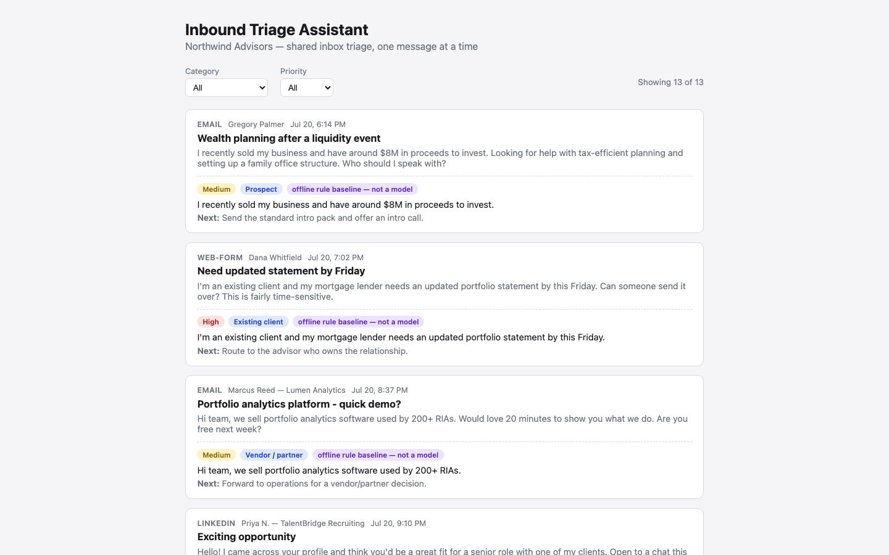
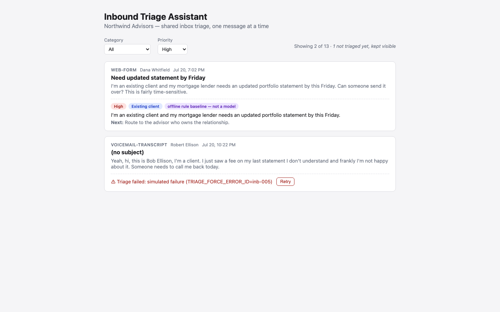
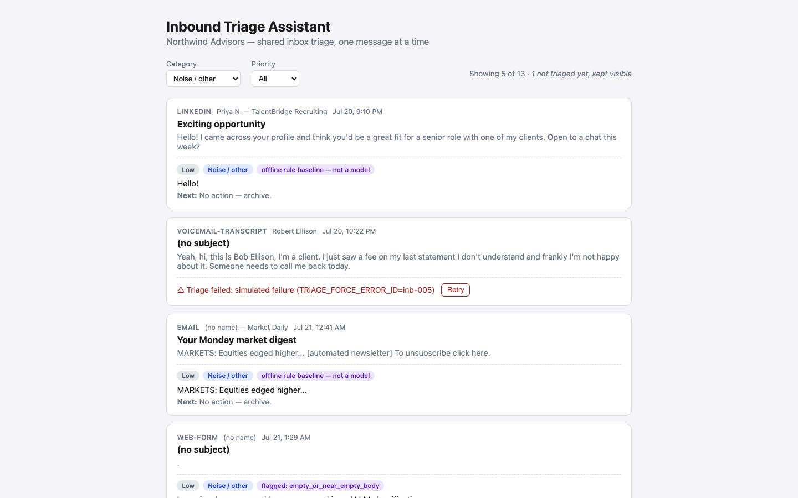
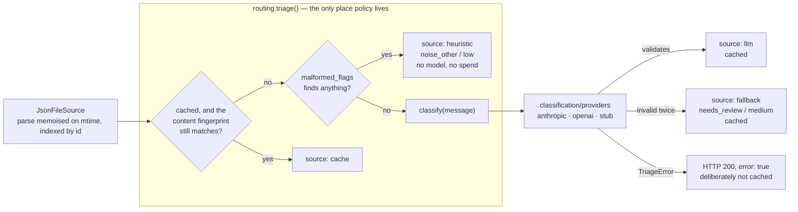
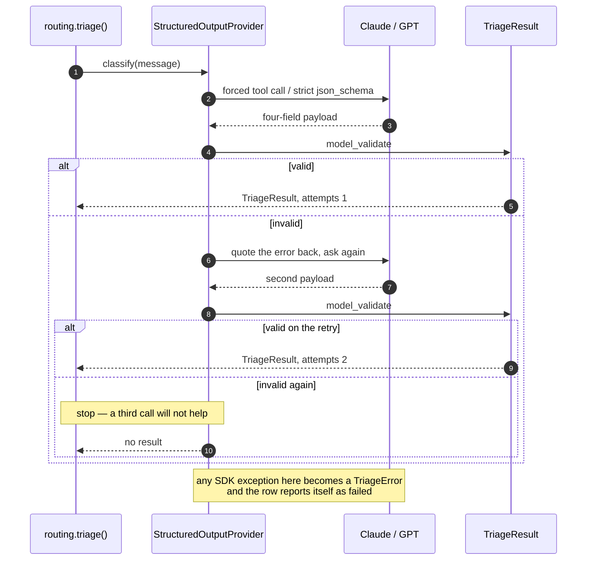

# Inbound Triage Assistant

A take-home for the **Arootah AI Product Engineer** brief. Northwind Advisors
(fictional) has a shared inbox; this reads the 13 messages in
`backend/data/inbound.json` and turns each into four fields a human can act on
— summary, category, priority, next action — without falling over on a garbled
message, a missing API key, or a model that returns something the schema does
not accept.

Classifying mail is the easy half. The half worth reviewing is what surrounds
the model call: a deterministic pre-check so garbage never costs a token,
provider-native schema enforcement re-validated server-side, one corrective
retry, a deterministic fallback, per-row error isolation, and a cache keyed on
message content rather than message id.
[`RATIONALE.md`](RATIONALE.md) is the written rationale the brief asks for;
[`prompts/triage_prompt.md`](prompts/triage_prompt.md) is the prompt itself.

## Run it

Needs [`uv`](https://docs.astral.sh/uv/), [`pnpm`](https://pnpm.io/) and Node ≥ 18.
**No API key is needed to start.** The app boots, serves the list, and every
deterministic path works without one — rows that need a model report a per-row
error instead of taking the page down.

```bash
# terminal 1
cd backend
uv sync                       # add the OpenAI provider: uv sync --extra openai
uv run fastapi dev src/triage_backend/main.py --port 8787
```

```bash
# terminal 2
cd frontend
pnpm install
pnpm dev
```

Open <http://localhost:5173>. The list renders immediately and each row triages
itself, at most three calls in flight. Prefixing the backend command with
`LLM_PROVIDER=stub` runs the whole thing end to end with no key and no spend —
`stub` is an offline rule-based baseline, described under
[Decisions](#decisions-id-defend-in-review). Containers are authored but
**unbuilt** (see [Known gaps](#known-gaps)): `docker compose up --build` would
put the UI on :8761 and the API on :8762.

## What you see

All three captured at 1440x900 with `LLM_PROVIDER=stub` and
`TRIAGE_FORCE_ERROR_ID=inb-005`. **They contain zero model output** — that is
why every triaged row is badged `offline rule baseline — not a model`. The UI
will not let a baseline result masquerade as a model result.

| | |
|---|---|
|  |  |
| **Unfiltered**, header reading `Showing 13 of 13`. Each card carries priority, category, provenance badge, a one-line summary and a next action. | **Priority = High.** `inb-005` — the angry-client voicemail — is being forced to fail, and stays on screen with an inline error and a Retry button. The counter says `Showing 2 of 13 · 1 not triaged yet, kept visible`. |



**Category = `Noise / other`**, `Showing 5 of 13`. The card at the bottom edge
is the malformed sample (`inb-010`, body `"."`): badged
`flagged: empty_or_near_empty_body` and resolved without a model call.

Terminal captures, all real runs: [`docs/api-transcript.txt`](docs/api-transcript.txt)
(curl against a live backend with **no key set**),
[`docs/eval-stub-baseline.txt`](docs/eval-stub-baseline.txt),
[`docs/bench-lookup.txt`](docs/bench-lookup.txt).

## The path a message takes

Three stages, pointing one way. `ingestion/` knows nothing about models;
`classification/` knows nothing about HTTP or caching; `routing/` owns the
policy and is the only layer that decides what a user sees. That split is why
the interesting branches below are ordinary Python a test can drive — no web
server, no model.



## When the model returns nonsense

The provider never asks for "JSON, please". Anthropic gets a forced
`tool_choice` on a single `emit_triage` tool; OpenAI gets a strict
`json_schema`. Both schemas and the prompt's category list are generated from
the same `MODEL_CATEGORIES` tuple in `schemas.py`, and whatever comes back is
re-validated against the Pydantic model those schemas were generated from. The
loop below lives once, in `classification/providers/structured.py` — the two
vendor classes only describe how to shape a request and where the payload sits.



## Decisions I'd defend in review

**`needs_review` is not a category the model may choose.** `ModelCategory` has
four values and is what the prompt and both schemas are built from;
`StoredTriageResult` widens to five. Only the deterministic fallback writes
`needs_review`, so a confident guess can never be stored as an admission of
failure.

**Model free text is bounded.** "≤ 20 words" in the prompt is a preference, not
a guarantee, so `summary` and `next_action` are whitespace-collapsed, required
non-empty and hard-capped at 400 characters. An unbounded model string is
otherwise an unbounded string in the UI *and* in the cache file.

**The cache key includes the message body, and a hit says so.** Each entry
stores a SHA-256 fingerprint of the triage-relevant fields, so editing a
message cannot serve a triage computed from text that is no longer there, and a
hit comes back as `source: "cache"` with a `cached:<original-source>` flag
rather than looking identical to a fresh call. `?refresh=true` busts one entry.
Writes go through `tempfile.mkstemp` + `os.replace` because the UI fans out
three requests at once and a half-written JSON file is a readable one —
`tests/test_cache.py::test_a_reader_never_sees_a_partially_written_file`
hammers reads against 800 writes and asserts zero parse failures.

**A filter must never hide an unresolved row.** Selecting `High` while a row is
still loading — or has just failed to classify — keeps that row visible with a
count, because in a triage tool that is precisely the message a human needs.
Pinned by `selectors.test.ts`'s `never hides a row that failed to triage`.

**Lookups are indexed, not re-parsed.** `JsonFileSource` memoises the parse
against the file's `(mtime, size)` and indexes by id. `scripts/bench_lookup.py`
measures it against `NaiveSource`, a deliberately un-indexed
read-parse-validate-scan kept in the script so the comparison is runnable
rather than asserted ([`docs/bench-lookup.txt`](docs/bench-lookup.txt), 200
lookups per cell):

| corpus | naive re-read + scan | `JsonFileSource` | ratio |
|---|---|---|---|
| 13 | 48.1 µs | 2.91 µs | 16x |
| 1,000 | 2,374.0 µs | 2.70 µs | 879x |
| 10,000 | 26,202.3 µs | 2.91 µs | 9,002x |

Per-lookup cost is flat in corpus size. Still a JSON file, not a data layer —
see Known gaps.

**An offline baseline to measure against.** `LLM_PROVIDER=stub` is a
transparent keyword classifier, so the suite, the screenshots and
`scripts/evaluate.py` run with no key and no spend and a real model has a floor
to beat. `auto` never selects it; its output is served as `source: "baseline"`.

**Two seams, because the docs promise two integrations.**
`register_provider(name, factory)` adds a model vendor without editing the
package, and `InboundSource` is a two-method protocol — which is what makes the
Airtable section below a design rather than a wish. Tests drive both by
swapping in a third-party implementation the way a future developer would.

## Where things live

```
backend/src/triage_backend/
  schemas.py          InboundMessage, TriageResult — the one output contract
  ingestion/          stage 1 — InboundSource protocol + JsonFileSource
  classification/     stage 2 — message -> TriageResult. No HTTP, no cache.
    heuristics.py       malformed pre-check, runs before any spend
    prompt.py           system prompt + both provider schemas, one taxonomy
    base.py             LLMProvider protocol, TriageOutcome, registry
    providers/          structured.py + anthropic / openai / stub
  routing/            stage 3 — triage() policy + content-keyed ResultCache
  routes/             HTTP surface only, deliberately thin
backend/tests/        154 tests, sockets blocked
backend/scripts/      evaluate.py (scores against eval/golden.json), bench_lookup.py
backend/eval/golden.json   reference labels, with the reasoning for each
backend/data/inbound.json  the 13-message corpus

frontend/src/
  App.tsx             view state and effects only
  lib/selectors.ts    filtering logic, tested without a DOM
  lib/limiter.ts      concurrency cap for the auto-triage fan-out
  components/         FilterBar, MessageList, MessageCard
```

## Environment

Read from the environment or `backend/.env`, all of it documented in
[`backend/.env.example`](backend/.env.example). **Nothing is required.**

| Variable | Default | Purpose |
|---|---|---|
| `LLM_PROVIDER` | `auto` | `anthropic`, `openai`, `stub` or `auto`. `auto` takes whichever key is set, Anthropic first, and never picks `stub`. |
| `ANTHROPIC_API_KEY` | *(empty)* | Anthropic credential. Absent → triage rows return a per-row error; nothing else breaks. |
| `MODEL_ID` | `claude-haiku-4-5-20251001` | Anthropic model. |
| `OPENAI_API_KEY` | *(empty)* | OpenAI credential. Needs the `openai` extra. |
| `OPENAI_MODEL_ID` | `gpt-4o-mini` | OpenAI model. |
| `LLM_TIMEOUT_SECONDS` | `30` | Per-request timeout, so a hung call cannot hold a worker thread open. |
| `LLM_TRANSPORT_RETRIES` | `1` | Vendor-SDK transport retries. Separate from the one *corrective* retry on invalid output. |
| `PORT` | `8787` | Port for `python -m triage_backend` and the container. `fastapi dev --port N` uses the flag instead. |
| `CORS_ORIGINS` | `http://localhost:5173,http://127.0.0.1:5173` | Origins allowed to call the API cross-origin. The Vite proxy makes the browser same-origin, so this only matters for direct callers. |
| `INBOUND_PATH` | `backend/data/inbound.json` | Corpus location. |
| `RESULTS_PATH` | `backend/data/results.json` | Triage cache location. |
| `TRIAGE_FORCE_ERROR_ID` | *(empty)* | Force one id to fail, to demonstrate the per-row error + Retry path on demand. |
| `VITE_PORT` | `5173` | Frontend dev-server port. |
| `VITE_API_TARGET` | `http://localhost:8787` | Where the dev server proxies `/api`. |

## Checks

```bash
cd backend
uv run pytest                                         # 154 passed
uv run ruff check . && uv run ruff format --check .
LLM_PROVIDER=stub uv run python scripts/evaluate.py   # free, offline
uv run python scripts/bench_lookup.py

cd ../frontend
pnpm test                                             # 21 passed
pnpm lint && pnpm exec tsc -b
```

**No test in either suite makes a network call**, and on the backend that is
enforced rather than hoped for: `tests/conftest.py` patches `socket.connect`,
`socket.connect_ex` and `socket.create_connection` to raise, so a test that
reaches for a paid API fails loudly instead of quietly billing. The same
fixture blanks every LLM environment variable, so a developer's real key cannot
leak in. Both provider classes are driven by hand-written fake clients.

## If this lived in Airtable

The brief allows either; local JSON needs no account to run. Two tables:
**Messages** (`id` primary, `received_at`, `channel`, `from_name`, `from_org`,
`subject`, `body`) and **Triage** (`message` linked to Messages, `summary`,
`category` and `priority` as single selects, `next_action`, `source`, `flags`,
`created_at`).

Triage in its own linked table, rather than extra columns on `Messages`, means
re-triaging never touches the raw inbound record and a message can hold a
history of attempts instead of exactly one. In code it is a second
`InboundSource` plus a second cache backend; nothing in `classification/`
changes.

## The one automation I'd add

**Trigger:** new `Triage` row with `priority = high` **and** `source != fallback`.
**Action:** post sender, one-line summary and `next_action` to the advisor Slack
channel. Excluding `fallback` matters — a fallback row is one the model failed
on, and paging a human with "needs human review" trains them to ignore it.

## Known gaps

- **No model has been run against this code here.** `scripts/evaluate.py` and
  `eval/golden.json` exist and run, but the only published numbers are from the
  offline `stub` baseline: **12/12 category and 11/12 priority on the 12 scored
  messages** (one is labelled ambiguous and excluded). Those rules were written
  while reading these exact 13 messages, so the number is overfitted by
  construction — a floor and a smoke test, not evidence about a model.
  `RATIONALE.md` §c says what a real run would need.
- **Structure is guaranteed. Correctness is not.** Forced tool calls and strict
  schemas make the *shape* reliable and say nothing about whether `medium` was
  the right priority. A confidently wrong triage looks exactly like a right
  one, which is why this is a triage aid and not an auto-router.
- **No confidence score, no abstention.** `needs_review` appears when output
  fails validation, not when the model is unsure. `inb-009` ("just following
  up") is genuinely ambiguous and gets a confident answer anyway.
- **The pre-check is pattern-matching, not comprehension.** Empty bodies,
  control bytes and undecoded MIME encoded-words are caught. A well-formed but
  meaningless message goes straight to the model.
- **The data layer is a JSON file.** Not a query surface, does not survive
  multiple processes, cache rewritten whole on each save. Fine for 13 messages.
- **No auth, no audit trail, no batching, no queue.** Anyone who can reach the
  API can triage anything, a re-triage overwrites the previous decision with no
  record, and one HTTP request per message does not survive real volume.
- **The containers are unbuilt.** Both Dockerfiles are multi-stage, run
  non-root and carry healthchecks, and `docker compose config` parses cleanly,
  but no image has been built or booted here. Reviewed source, not verified
  images.

## How I used AI

Built with Claude Code end to end. The correction worth recording: `except
anthropic.APIError` around the model call looks right and is wrong — with no
resolvable key the SDK raises a plain `TypeError` from header validation
*before* the request goes out, so the exact unhappy path the brief asks about
surfaced as a raw 500. The catch is now deliberately broad at that one
boundary, and
`tests/test_provider_anthropic.py::test_any_api_failure_becomes_a_triage_error`
parametrises `TypeError` alongside `ConnectionError` so it cannot come back.
