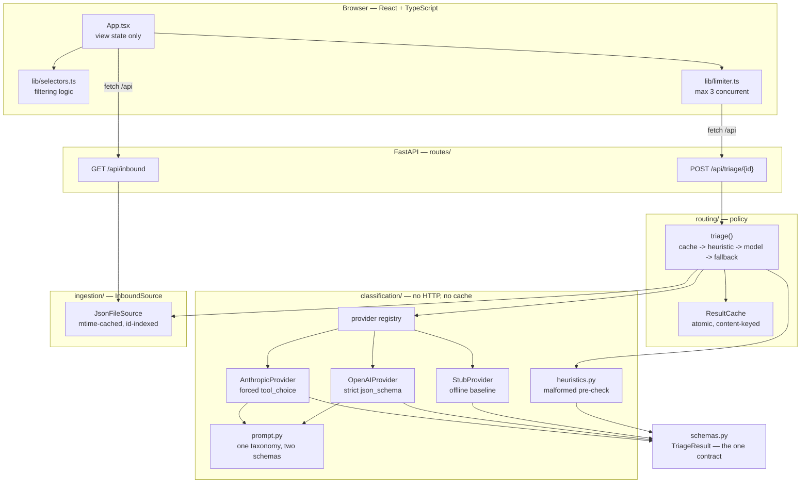
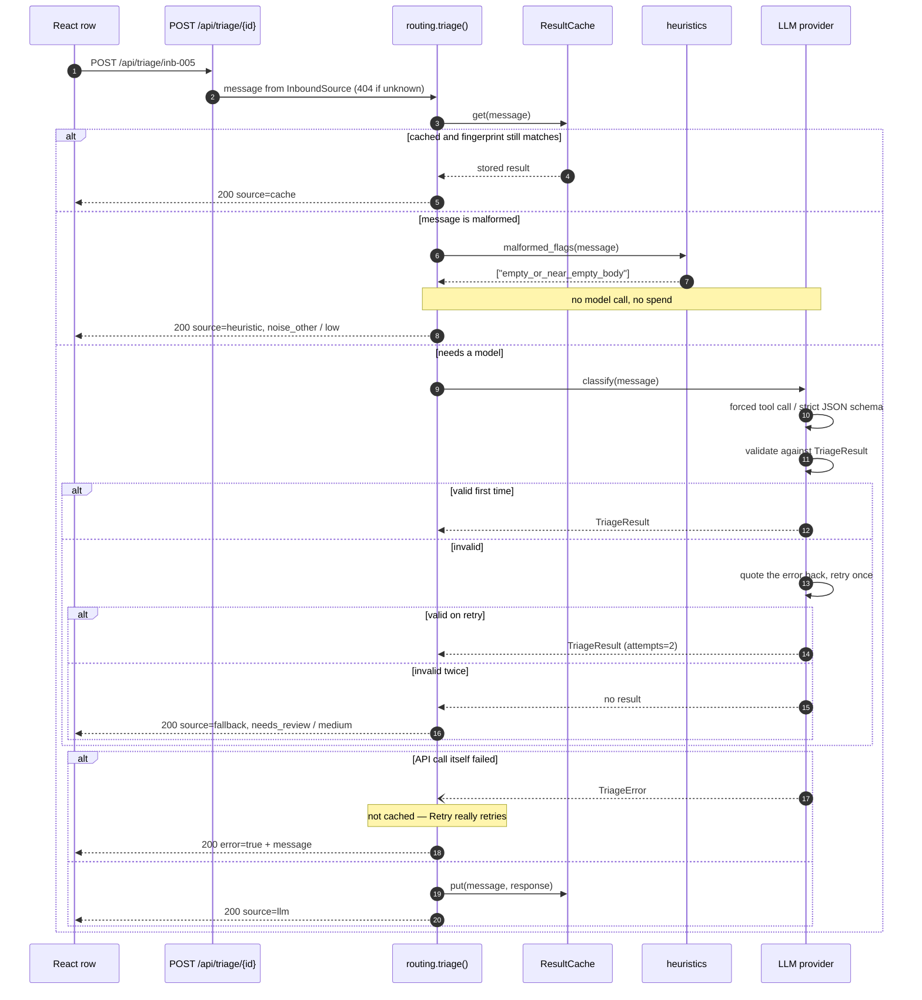

# Inbound Triage Assistant

A take-home build for the **Arootah AI Product Engineer** brief: a shared-inbox
triage tool for a fictional advisory firm, Northwind Advisors. It lists the 13
inbound messages in `backend/data/inbound.json`, sends each one to an LLM that
is *forced* to return a four-field structured result (summary, category,
priority, next action), and renders the result per row — without falling over
on a malformed message, an API error, or a model that returns nonsense.

The interesting part is not the classification. It is everything around it: a
deterministic pre-check so garbage never costs a token, provider-native schema
enforcement plus server-side re-validation, one corrective retry, a
deterministic fallback, per-row error isolation, and a content-keyed cache.
[`RATIONALE.md`](RATIONALE.md) is the written engineering rationale the brief
asks for; [`prompts/triage_prompt.md`](prompts/triage_prompt.md) is the prompt.

## Screenshots

Captured at 1440x900 against the app running locally. **The provider was
`LLM_PROVIDER=stub`** — the offline rule-based baseline, not a model — so these
contain zero model output and cost nothing. That is why every triaged row is
badged `offline rule baseline — not a model`: the UI refuses to let a baseline
result look like a model result.

| | |
|---|---|
|  |  |
| **The list.** Each row carries its own priority, category, provenance badge, one-line summary and suggested next action. | **Filtered to `High`.** `TRIAGE_FORCE_ERROR_ID=inb-005` is making the angry-client voicemail fail. It stays on screen with an inline error and a Retry button — see [Design notes](#design-notes) for why hiding it would be a bug. |


**Filtered to `Noise / other`.** The bottom row is the malformed sample
(`inb-010`, body `"."`): badged `flagged: empty_or_near_empty_body`, resolved
deterministically, never sent to a model.

Terminal evidence, all from real runs: [`docs/api-transcript.txt`](docs/api-transcript.txt)
(request/response pairs with **no API key set**),
[`docs/eval-stub-baseline.txt`](docs/eval-stub-baseline.txt) (the evaluation
harness), [`docs/bench-lookup.txt`](docs/bench-lookup.txt) (the lookup benchmark).

## Architecture

Three layers, one direction. Ingestion knows nothing about models; classification
knows nothing about HTTP or caching; routing owns the policy and is the only
place that decides what a user sees.



## How one message is triaged

Every branch below is exercised by a test; none of them can reach the network.



## Quickstart

Requires [`uv`](https://docs.astral.sh/uv/), [`pnpm`](https://pnpm.io/) and Node ≥ 18.
**No API key is needed to start** — the app runs, and every deterministic path
works, without one.

```bash
# 1. Backend — terminal 1
cd backend
uv sync                      # add the OpenAI provider: uv sync --extra openai
cp .env.example .env         # optional: paste a key, or set LLM_PROVIDER=stub
uv run fastapi dev src/triage_backend/main.py --port 8787
```

```bash
# 2. Frontend — terminal 2
cd frontend
pnpm install
pnpm dev
```

Open <http://localhost:5173>. The list loads immediately and each row triages
itself, at most three calls in flight at a time.

To see it end to end with no key and no spend, start the backend with
`LLM_PROVIDER=stub uv run fastapi dev src/triage_backend/main.py --port 8787`.

Containers (authored, not yet built — see [Design notes](#design-notes)):

```bash
docker compose up --build   # UI on http://localhost:8761, API on :8762
```

## Configuration

Everything is read from the environment (or `backend/.env`); see
[`backend/.env.example`](backend/.env.example). No value is required.

| Variable | Required | Default | Purpose |
|---|---|---|---|
| `LLM_PROVIDER` | no | `auto` | `anthropic`, `openai`, `stub`, or `auto`. `auto` uses whichever key is set, Anthropic first, and **never** selects `stub`. |
| `ANTHROPIC_API_KEY` | no | *(empty)* | Anthropic credential. Absent → triage rows return a per-row error; nothing else breaks. |
| `MODEL_ID` | no | `claude-haiku-4-5-20251001` | Anthropic model for triage calls. |
| `OPENAI_API_KEY` | no | *(empty)* | OpenAI credential. Needs the `openai` extra installed. |
| `OPENAI_MODEL_ID` | no | `gpt-4o-mini` | OpenAI model for triage calls. |
| `LLM_TIMEOUT_SECONDS` | no | `30` | Per-request timeout for a model call, so a hung call cannot hold a worker thread open indefinitely. |
| `LLM_TRANSPORT_RETRIES` | no | `1` | Transport-level retries inside the vendor SDK before the row is reported failed. Separate from the one *corrective* retry on invalid output. |
| `PORT` | no | `8787` | Port for `python -m triage_backend` and the container. `fastapi dev --port N` uses the flag instead. |
| `CORS_ORIGINS` | no | `http://localhost:5173,http://127.0.0.1:5173` | Origins allowed to call the API cross-origin. The Vite proxy makes the browser same-origin, so this only matters for direct callers. |
| `INBOUND_PATH` | no | `backend/data/inbound.json` | Message corpus location. |
| `RESULTS_PATH` | no | `backend/data/results.json` | Triage cache location. |
| `TRIAGE_FORCE_ERROR_ID` | no | *(empty)* | Force one inbound id to fail, to demonstrate the per-row error + Retry path on demand. |
| `VITE_PORT` | no | `5173` | Frontend dev-server port. |
| `VITE_API_TARGET` | no | `http://localhost:8787` | Where the dev server proxies `/api`. |

## Development

```bash
# Backend
cd backend
uv run pytest                       # 154 tests, no network, no key needed
uv run pytest --cov                 # with coverage
uv run ruff check . && uv run ruff format .

# Offline evaluation against the hand-written reference labels
LLM_PROVIDER=stub uv run python scripts/evaluate.py
# ...or against a real model, if you have a key and want to spend 13 calls
uv run python scripts/evaluate.py --json report.json

# Lookup benchmark quoted in Design notes
uv run python scripts/bench_lookup.py
```

```bash
# Frontend
cd frontend
pnpm test            # vitest, 21 tests
pnpm lint
pnpm exec tsc -b     # type-check
pnpm build
```

**No test in either suite makes a network call.** On the backend that is
enforced, not hoped for: `tests/conftest.py` patches `socket.connect` to raise,
so a test that reaches for an API fails loudly instead of quietly billing.
Every test also runs against a scrubbed environment, so a developer's real key
cannot leak into a run.

## Project structure

```
backend/
  src/triage_backend/
    config.py               Settings (cached, env-driven)
    schemas.py              InboundMessage, TriageResult — the one contract
    ingestion/              stage 1: where messages come from
      source.py             InboundSource protocol + JsonFileSource
    classification/         stage 2: message -> TriageResult. No HTTP, no cache.
      heuristics.py         malformed pre-check, runs before any spend
      prompt.py             system prompt + both provider schemas, one taxonomy
      base.py               LLMProvider protocol, TriageOutcome, registry
      providers/
        structured.py       shared call -> validate -> correct -> retry loop
        anthropic_provider.py   forced tool_choice
        openai_provider.py      strict json_schema
        stub_provider.py        offline rule baseline, never auto-selected
    routing/                stage 3: policy + persistence
      __init__.py           triage(): cache -> heuristic -> model -> fallback
      cache.py              atomic, content-fingerprinted result cache
    routes/                 HTTP surface only, deliberately thin
    main.py                 app wiring
  tests/                    154 tests, network blocked
  scripts/
    evaluate.py             score the pipeline against eval/golden.json
    bench_lookup.py         measure lookup cost, old vs new
  eval/golden.json          hand-written reference labels + reasoning
  data/inbound.json         the 13-message sample corpus

frontend/src/
  App.tsx                   view state and effects only
  lib/selectors.ts          filtering logic, tested without a DOM
  lib/limiter.ts            concurrency cap for the auto-triage fan-out
  api/client.ts             the two fetch calls
  components/               FilterBar, MessageList, MessageCard

docs/                       real captured output + screenshots
prompts/triage_prompt.md    the prompt, mirrored for review
RATIONALE.md                the brief's Engineering Rationale
```

## Design notes

**Ingestion → classification → routing, and why it matters here.** The original
version put the decision table inside the FastAPI handler and the model call
inside a module that also owned the prompt, the provider choice and the retry
loop. Splitting it means the interesting logic — when to skip the model, when
to retry, when to give up, what to show when it fails — is now ordinary Python
that a test can drive directly. That is the whole reason the suite can cover
the failure paths: none of them need a web server, and none of them need a
model.

**One taxonomy, two provider schemas, one validator.** `MODEL_CATEGORIES` in
`schemas.py` generates the prompt's category list, the Anthropic tool's
`input_schema` enum and the OpenAI `json_schema` enum, and is what
`TriageResult` validates against. `RATIONALE.md` claims adding a category is a
one-line change; `tests/test_prompt.py` is what makes that claim checkable
rather than aspirational.

**`needs_review` is not a category the model can choose.** `ModelCategory` has
four values; `StoredTriageResult` widens to five. Only the deterministic
fallback may write `needs_review`. Before, the model could have emitted it and
a confident guess would have been indistinguishable from an admission of
failure.

**Free-text from a model is bounded.** The prompt asks for "≤ 20 words". That
is a preference, not a guarantee, so `summary` and `next_action` are
whitespace-collapsed and hard-capped at 400 characters in the validator. An
unbounded model string is an unbounded string in the UI *and* in the cache file.

**Cache keys include the message content.** Keying on id alone means editing a
message serves a triage computed from text that is no longer there. Each entry
stores a SHA-256 fingerprint of the triage-relevant fields; a mismatch is a
miss. Writes go through a temp file and `os.replace`, because the UI fans out
three requests at a time and a half-written JSON file is a readable one.

**A cache hit says so.** `source: "cache"` existed in the schema and in the
frontend types but was never once emitted — every hit was served as
`source: "llm"`. A cached result and a fresh one were indistinguishable. They
are not any more, and `?refresh=true` busts one entry.

**Scalability: the real bottleneck was the lookup, not the model.**
`get_inbound_by_id` re-read the JSON file, re-parsed it, re-validated every
record into a Pydantic model and then linear-scanned — *per call*. The UI makes
one call per row, so rendering N messages re-parsed the whole corpus N times.
`JsonFileSource` memoises the parse against the file's `(mtime, size)` and
indexes by id. Measured with `scripts/bench_lookup.py`, 200 lookups per cell
(full output in [`docs/bench-lookup.txt`](docs/bench-lookup.txt)):

| corpus | naive (pre-uplift) | indexed (current) | speedup |
|---|---|---|---|
| 13 | 48.1 µs | 2.91 µs | 16x |
| 1,000 | 2,374.0 µs | 2.70 µs | 879x |
| 10,000 | 26,202.3 µs | 2.91 µs | 9,002x |

The per-lookup cost is now flat in corpus size. This is still not a production
data layer — see Limitations — but the O(n)-per-request read is gone, and the
next bottleneck is honestly the model calls themselves.

**Extensibility: two seams, both of which the docs already promised.**
`register_provider(name, factory)` adds a model vendor without touching the
package (`tests/test_provider_resolution.py` registers one the way a future
developer would). `InboundSource` is a two-method protocol, which is what makes
the Airtable section below a design rather than a wish.

**An offline baseline you can measure against.** `LLM_PROVIDER=stub` is a
transparent keyword classifier. It exists so the UI, the tests and the
screenshots run with no key and no spend, and so `scripts/evaluate.py` has a
floor to compare a model against. It is never selected by `auto`, and its
results are served as `source: "baseline"` so they can never be read as model
output.

**Errors are never hidden by a filter.** Filtering used to drop any row without
a result, so choosing `High` hid the message that had just failed to classify —
in a triage tool, precisely the message a human needs. Unresolved rows now stay
visible with a count, which is what the second screenshot is showing.

**Docker.** `backend/Dockerfile` and `frontend/Dockerfile` are multi-stage,
run as non-root, and carry healthchecks; `docker-compose.yml` puts the API
behind nginx so the browser is same-origin in a container exactly as it is
behind the Vite proxy. **They have been parse-checked with
`docker compose config` but never built or booted** — the Docker daemon was
deliberately off in this environment. Treat them as reviewed source, not as a
verified image.

## Airtable data model (if this moved off local JSON)

Two tables, one link:

- **Messages** — `id` (primary), `received_at`, `channel`, `from_name`,
  `from_org`, `subject`, `body`.
- **Triage** — `message` (link to Messages), `summary`, `category` (single
  select), `priority` (single select), `next_action`, `source`,
  `flags`, `created_at`.

Keeping triage in its own linked table rather than adding columns to `Messages`
means re-triaging never touches the raw inbound record, and a message can hold
a history of attempts rather than exactly one. On the code side this is a new
`InboundSource` implementation plus a new cache backend; nothing in
`classification/` changes.

## One n8n/Zapier automation I'd add

**Trigger:** new `Triage` row where `priority = high` **and** `source != fallback`.
**Action:** post to the advisor Slack channel with sender, one-line summary and
`next_action`. Excluding `fallback` matters: a row that reached the fallback is
one the model failed on, and paging a human with "needs human review" as the
summary trains them to ignore the channel.

## Limitations

- **The model is not evaluated in this repository.** `scripts/evaluate.py` and
  `eval/golden.json` exist and run, but the only published numbers are from the
  offline `stub` baseline, which scored 12/12 category and 11/12 priority on the
  13-message set. That number is **overfitted by construction** — the rules were
  written against these exact messages. It is a floor and a smoke test, not
  evidence about a model. `RATIONALE.md` §c says what a real run would need.
- **The AI guarantees structure, not correctness.** Forced tool calls and strict
  JSON schemas mean the *shape* is reliable. They say nothing about whether
  `medium` was the right priority. A confidently wrong triage is visually
  identical to a right one — this is the biggest risk in shipping it, and is why
  it is a triage aid, not an auto-router.
- **No confidence score and no abstention.** The model cannot say "I don't
  know"; `needs_review` only appears when its output fails validation, not when
  it is merely unsure. `inb-009` ("just following up") is genuinely ambiguous and
  the tool will answer it confidently anyway.
- **The malformed pre-check is pattern-matching, not comprehension.** It catches
  empty bodies, control bytes and undecoded MIME encoded-words. A well-formed
  but meaningless message passes straight through to the model.
- **The data layer is a JSON file.** It is not a query surface, it does not
  survive multiple processes, and the cache is a single file rewritten on each
  save. Fine for 13 messages; see the Airtable section for what replaces it.
- **No auth, no multi-tenancy, no audit trail.** Anyone who can reach the API
  can triage anything, and a re-triage overwrites the previous decision with no
  record of what changed.
- **No batching and no queue.** One HTTP request per message, capped at three
  concurrent from the browser. At real inbound volume this needs a worker and
  batched calls, not a wider concurrency limit.
- **Containers are unbuilt.** See Design notes.

## How I used AI

Built with Claude Code end to end. The correction worth recording: the original
`except anthropic.APIError` around the model call looked right and was wrong —
the Anthropic SDK raises a plain `TypeError` from header validation *before* the
request goes out when no key is resolvable, so the exact unhappy path the brief
asks about was unhandled and surfaced as a raw 500. The catch is now
deliberately broad at that one boundary, and
`tests/test_provider_anthropic.py::test_any_api_failure_becomes_a_triage_error`
parametrises `TypeError` alongside `ConnectionError` so the regression cannot
come back.
